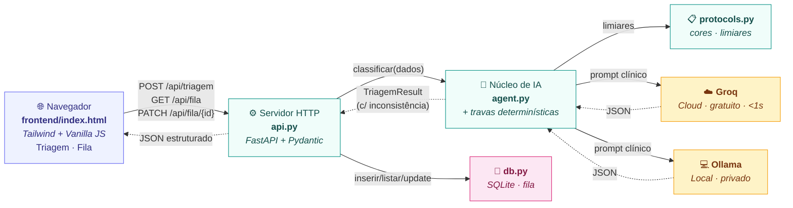

# Sistema de Triagem com IA — Protocolo de Manchester

Sistema de Apoio à Decisão (SAD) que utiliza um Large Language Model (LLM) para classificar a prioridade de atendimento de pacientes em UPAs e prontos-socorros segundo o **Protocolo de Manchester**, com **explicabilidade nativa (XAI)** o modelo justifica em linguagem natural o raciocínio clínico de cada decisão.

> Trabalho da disciplina **Tópicos Especiais em Computação II — URI**

---

## Sumário

1. [Visão geral](#1-visão-geral)
2. [Arquitetura](#2-arquitetura)
3. [Estrutura de arquivos](#3-estrutura-de-arquivos)
4. [Requisitos](#4-requisitos)
5. [Instalação passo a passo](#5-instalação-passo-a-passo)
6. [Configuração](#6-configuração)
7. [Como executar](#7-como-executar)
8. [Como usar](#8-como-usar)
9. [Endpoints da API](#9-endpoints-da-api)
10. [Travas determinísticas (rule-based override)](#10-travas-determinísticas-rule-based-override)
11. [Fila viva](#11-fila-viva)
12. [Avaliação com golden set](#12-avaliação-com-golden-set)
13. [Resolução de problemas comuns](#13-resolução-de-problemas-comuns)
14. [Protocolo de Manchester](#14-protocolo-de-manchester)
15. [Limitações conhecidas](#15-limitações-conhecidas)

---

## 1. Visão geral

O sistema permite que um enfermeiro descreva os sintomas e sinais vitais de um paciente em linguagem natural, e recebe em segundos uma classificação de risco (vermelho, laranja, amarelo, verde ou azul) acompanhada da justificativa clínica que motivou a decisão. O LLM atua na **zona cinzenta** entre os protocolos formais e a interpretação ambígua dos sintomas, tornando a decisão auditável e aceitável pelo gestor.

### Camadas de segurança

A decisão final **não depende exclusivamente do LLM**:

1. **Camada do LLM**: gera classificação + justificativa em linguagem natural (XAI).
2. **Travas determinísticas (rule-based override)**: sobrepõem o LLM quando sinais vitais objetivos cruzam limiares críticos (SpO₂ < 90, PA sistólica < 90, FC > 140, T > 39,5 °C, etc.). Se a trava elevar a cor, a interface mostra um banner de **inconsistência** explicando a divergência. As travas só sobem a gravidade — nunca rebaixam.
3. **Fila viva persistida**: cada triagem é gravada em SQLite com identificação do enfermeiro e do paciente, status de atendimento e cronômetro do tempo máximo Manchester.

### Backends de IA

O backend de IA é **trocável em tempo de execução** entre dois provedores:

- **Groq**: API gratuita na nuvem, ultrarrápida (resposta em menos de 1 segundo)
- **Ollama**: modelo local rodando na própria máquina (privacidade total, sem custo, sem dependência de internet)

---

## 2. Arquitetura

A aplicação é dividida em camadas independentes que se comunicam por HTTP:



### Responsabilidades de cada camada

| Camada | Arquivo | Responsabilidade |
|--------|---------|------------------|
| **Frontend** | `frontend/index.html` | Interface do enfermeiro: formulário, resultado, **aba Fila** com cronômetro Manchester, histórico da sessão (localStorage), nome do enfermeiro persistido entre sessões |
| **API HTTP** | `api.py` | Validação dos dados (Pydantic), roteamento, endpoints de triagem e de fila, tratamento de erros, serve o frontend |
| **Agente de IA** | `agent.py` | Monta o prompt clínico, chama o backend LLM, aplica **travas determinísticas** sobre os sinais vitais, parseia o JSON e marca inconsistências |
| **Protocolo** | `protocols.py` | Constantes do Manchester: cores, tempos máximos, sinais de alarme, faixas de referência e `LIMIARES_CRITICOS` usados pelas travas |
| **Persistência** | `db.py` | Camada SQLite (zero dependências externas): `init_db`, `inserir_triagem`, `listar_fila`, `atualizar_status`. Banco em `triagens.db` |
| **LLM (cloud)** | Groq API | Geração da classificação + justificativa em linguagem natural — resposta em &lt;1s |
| **LLM (local)** | Ollama | Mesmo papel da Groq, mas rodando 100% offline na máquina do usuário |
| **Avaliação** | `eval/runner.py` | Script standalone que roda 30 vinhetas clínicas (`eval/golden_set.json`) contra todos os modelos Groq, calcula acurácia e matriz de confusão |

A separação entre **frontend estático**, **backend Python**, **persistência** e **provedor LLM** desacopla a interface da lógica de IA. O mesmo `agent.py` pode ser reaproveitado em outras interfaces (CLI, mobile, integração com prontuário eletrônico) sem modificação. A troca entre Groq e Ollama acontece em runtime através de uma classe abstrata `LLMBackend` com duas implementações (`GroqBackend` e `OllamaBackend`).

---

## 3. Estrutura de arquivos

```
manchester-ai/
├── api.py                  # Servidor FastAPI (entry point) — endpoints /api/triagem e /api/fila
├── agent.py                # Núcleo de IA + abstração de backend + travas determinísticas
├── protocols.py            # Constantes Manchester: CORES, FAIXAS_REFERENCIA, LIMIARES_CRITICOS
├── db.py                   # Camada SQLite da fila viva (sem dependências externas)
├── triagens.db             # Banco SQLite gerado em runtime (ignorado pelo git)
├── frontend/
│   └── index.html          # SPA com aba "Triagem" e aba "Fila" (Tailwind + Lucide + JS vanilla)
├── eval/
│   ├── golden_set.json     # 30 vinhetas clínicas (6 por cor) com cor esperada
│   ├── runner.py           # Avalia o classificador em todos os modelos Groq
│   ├── results_*.json      # Relatórios versionados de cada execução (ignorados pelo git)
│   └── README.md           # Como rodar e interpretar
├── requirements.txt        # Dependências Python
├── .env.example            # Template para a chave da API
├── .gitignore              # Ignora .env, venv, triagens.db e eval/results_*
└── README.md               # Este arquivo
```

---

## 4. Requisitos

### Software obrigatório

| Software | Versão mínima | Por quê |
|----------|---------------|---------|
| **Python** | 3.10 ou superior | Linguagem do backend |
| **pip**    | 22+              | Gerenciador de pacotes Python (vem com Python) |
| **Navegador moderno** | Chrome 100+, Firefox 100+, Edge 100+ | Usa fetch API e CSS moderno |

### Software opcional

| Software | Quando usar |
|----------|-------------|
| **Ollama** | Se você quiser rodar o LLM 100% local na sua máquina |
| **Git** | Se for clonar o projeto de um repositório |

### Hardware

| Cenário | Mínimo recomendado |
|---------|--------------------|
| Apenas backend Groq (cloud) | 4 GB RAM, qualquer CPU dos últimos 10 anos |
| Backend Ollama com modelos pequenos (gemma2:2b, llama3.2:3b) | 8 GB RAM |
| Backend Ollama com modelos médios (mistral:7b, llama3.1:8b) | 16 GB RAM |
| Backend Ollama com modelos grandes (deepseek-r1:32b, llama3.3:70b) | 32+ GB RAM |

### Conta gratuita necessária

Para usar o backend Groq (recomendado), você precisa criar uma conta em <https://console.groq.com> e gerar uma chave de API (formato `gsk_...`). É 100% gratuito, sem cartão de crédito, com limite de aproximadamente 14.400 requisições por dia — mais que suficiente para o projeto.

---

## 5. Instalação passo a passo

> A seção abaixo cobre Windows. Para macOS e Linux, os comandos equivalentes estão indicados quando necessário.

### 5.1. Instalar o Python

**Windows:**

A forma mais limpa é via `winget`, que já vem no Windows 10/11:

```powershell
winget install Python.Python.3.12
```

Alternativamente, baixe o instalador oficial em <https://www.python.org/downloads/> e, na primeira tela do instalador, **marque a caixa "Add python.exe to PATH"** antes de clicar em *Install Now*.

**macOS:**

```bash
brew install python@3.12
```

**Linux (Debian/Ubuntu):**

```bash
sudo apt update && sudo apt install python3 python3-venv python3-pip
```

### 5.2. Verificar a instalação

Feche e reabra o PowerShell (ou terminal), então rode:

```powershell
python --version
pip --version
```

Os dois devem responder com a versão. Se o Python não for encontrado, veja a [seção 10](#10-resolução-de-problemas-comuns).

### 5.3. (Apenas Windows) Liberar execução de scripts no PowerShell

Por padrão o Windows bloqueia scripts `.ps1` (incluindo o `Activate.ps1` do venv). Libere uma vez para o seu usuário:

```powershell
Set-ExecutionPolicy -ExecutionPolicy RemoteSigned -Scope CurrentUser
```

Quando perguntado, digite `S` (ou `Y`) e pressione Enter. Esta alteração afeta apenas o seu usuário, não o sistema todo.

### 5.4. Entrar na pasta do projeto

```powershell
cd "C:\Users\<seu_usuario>\Desktop\Projeto Topicos"
```

### 5.5. Criar e ativar o ambiente virtual

```powershell
# Criar
python -m venv venv

# Ativar (Windows PowerShell)
.\venv\Scripts\Activate.ps1
```

Em macOS/Linux:

```bash
python3 -m venv venv
source venv/bin/activate
```

Quando o venv estiver ativo, o prompt vai mudar para algo como `(venv) PS C:\Users\...`. Esse `(venv)` é o sinal de que está tudo certo.

### 5.6. Instalar as dependências

```powershell
pip install -r requirements.txt
```

Isso instala 6 pacotes:

| Pacote | Para quê |
|--------|----------|
| `fastapi` | Framework do backend HTTP |
| `uvicorn[standard]` | Servidor ASGI que roda o FastAPI |
| `groq` | SDK oficial da Groq |
| `ollama` | SDK do Ollama (cliente HTTP local) |
| `python-dotenv` | Carrega variáveis do `.env` |
| `pydantic` | Validação automática de payloads |

---

## 6. Configuração

### 6.1. Criar o arquivo `.env`

Copie o template:

```powershell
# Windows
copy .env.example .env

# macOS/Linux
cp .env.example .env
```

Abra o `.env` no seu editor preferido (`notepad .env` no Windows). Você verá:

```ini
GROQ_API_KEY=cole_sua_chave_aqui
OLLAMA_HOST=http://localhost:11434
```

### 6.2. Gerar e colar a chave da Groq

1. Acesse <https://console.groq.com/keys>
2. Faça login (Google, GitHub ou e-mail)
3. Clique em **Create API Key**
4. Dê um nome qualquer (ex: "Triagem URI") e crie
5. **Copie a chave imediatamente** (ela começa com `gsk_...` e só aparece uma vez)
6. Cole no `.env` no lugar de `cole_sua_chave_aqui`
7. Salve e feche

A linha final deve ficar assim:

```ini
GROQ_API_KEY=Sua_chave
```

> **Importante:** O arquivo `.env` está no `.gitignore`, então nunca será commitado num repositório. Não compartilhe sua chave com ninguém.

### 6.3. (Opcional) Instalar e configurar o Ollama

Se você quiser rodar o LLM localmente em vez de usar a Groq:

**Windows / macOS:** baixe o instalador em <https://ollama.com/download> e execute.

**Linux:**

```bash
curl -fsSL https://ollama.com/install.sh | sh
```

Após instalar, baixe pelo menos um modelo (escolha conforme a RAM da sua máquina):

```powershell
ollama pull mistral:7b      # 4 GB no disco, recomendado, equilíbrio velocidade/qualidade
ollama pull llama3.1:8b     # 5 GB, raciocínio clínico ainda melhor
ollama pull gemma2:2b       # 1.6 GB, leve para máquinas com 8 GB de RAM
ollama pull deepseek-r1:8b  # 5 GB, raciocínio passo a passo, ótimo para demonstrar XAI
```

O serviço do Ollama já fica rodando em segundo plano após a instalação (porta 11434). Para testar:

```powershell
ollama list
```

> **Servidor remoto:** Se quiser que outra máquina (ex: notebook) use o Ollama do seu desktop, edite a variável `OLLAMA_HOST` no `.env` para `http://IP_DO_DESKTOP:11434` e configure o Ollama do desktop para escutar em todas as interfaces (variável de ambiente `OLLAMA_HOST=0.0.0.0`).

---

## 7. Como executar

Com o venv ativado e o `.env` configurado:

```powershell
uvicorn api:app --reload
```

Você verá uma saída parecida com:

```
INFO:     Will watch for changes in these directories: ['C:\\Users\\...\\Projeto Topicos']
INFO:     Uvicorn running on http://127.0.0.1:8000 (Press CTRL+C to quit)
INFO:     Started reloader process
INFO:     Application startup complete.
```

Abra no navegador:

```
http://localhost:8000
```

### Flags úteis do uvicorn

| Comando | Quando usar |
|---------|-------------|
| `uvicorn api:app --reload` | **Desenvolvimento** — recarrega automaticamente quando você edita um arquivo |
| `uvicorn api:app` | **Apresentação** — sem hot reload, mais estável |
| `uvicorn api:app --host 0.0.0.0 --port 8000` | **Acesso pela rede local** — outras máquinas da mesma rede podem acessar via IP da sua máquina |
| `uvicorn api:app --port 5000` | **Trocar a porta** se a 8000 estiver ocupada |

Para parar o servidor: `Ctrl + C` no terminal.

---

## 8. Como usar

### 8.1. Realizar uma triagem

1. **Identifique o enfermeiro responsável** no topo do formulário (nome ou matrícula). O valor é persistido em `localStorage` para não precisar redigitar a cada triagem.
2. **Escolha o backend** no canto superior direito (botão "Groq · modelo"). Você pode trocar entre Groq (cloud) e Ollama (local) e selecionar o modelo desejado.
3. **Carregue um caso demo** clicando em um dos chips no topo da página (*Tosse leve*, *Cefaleia + HAS* ou *Dor torácica*) para preencher o formulário com um cenário típico.
4. **Preencha os dados do paciente**: nome (opcional), idade, sexo, sinais vitais (PA, FC, SpO₂, temperatura) e a descrição livre dos sintomas. O campo de histórico clínico é opcional.
   - **Ditado por voz**: clique no ícone de microfone dentro do campo "Queixa principal e sintomas" para ditar em vez de digitar (pt-BR). Usa a Web Speech API nativa do navegador — não envia áudio para a API e não consome tokens. Funciona em Chrome, Edge e Safari (Firefox ainda não tem suporte nativo).
5. Clique em **Realizar triagem**.
6. O resultado aparece à direita com:
   - **Cor do Manchester** (vermelho, laranja, amarelo, verde, azul) e tempo máximo de espera
   - **Banner de inconsistência** (quando aplicável) — alerta amarelo informando que as travas determinísticas elevaram a classificação que o LLM havia escolhido, listando os critérios objetivos disparados (ex.: *"SpO₂ 88% < 90%"*)
   - **Justificativa clínica** em linguagem natural (XAI)
   - **Sinais de alerta** identificados pelo modelo
   - **Perguntas adicionais sugeridas** quando há ambiguidade
   - **Nível de confiança** do modelo na decisão
7. O **histórico da sessão** fica disponível abaixo do resultado e é persistido no `localStorage` do navegador.

### 8.2. Consultar a fila

Cada triagem é gravada automaticamente no banco SQLite. Para ver a fila ordenada:

1. Clique na aba **Fila** no canto superior direito (ao lado do botão Triagem).
2. Cada paciente é exibido como um card com:
   - Banda colorida da cor Manchester e nome do paciente
   - **Cronômetro regressivo** mostrando o tempo restante até estourar a janela do protocolo. Quando o tempo acaba, o cronômetro pisca em vermelho indicando atraso.
   - Sinais vitais resumidos, enfermeiro responsável, justificativa colapsável
   - Tag amarela "Trava" quando a classificação foi corrigida pelas regras determinísticas
   - Botões **Marcar atendido** e **Dispensar** para mover o paciente para fora da fila ativa
3. Marque a checkbox **Incluir finalizados** para ver também atendimentos já concluídos.
4. O badge vermelho ao lado do botão "Fila" mostra quantos pacientes estão aguardando.
5. A fila persiste entre reinícios do servidor — o banco fica em `triagens.db` na raiz do projeto.

---

## 9. Endpoints da API

| Método | Rota                  | Descrição |
|--------|-----------------------|-----------|
| GET    | `/`                   | Serve o frontend (`index.html`) |
| GET    | `/api/health`         | Health check (retorna `{"status":"ok"}`) |
| GET    | `/api/models`         | Lista modelos disponíveis por backend e cores do Manchester |
| POST   | `/api/triagem`        | Executa a triagem (body JSON com dados do paciente, enfermeiro e modelo). Persiste no SQLite e retorna o `triagem_id`. |
| GET    | `/api/fila`           | Lista pacientes na fila ordenados por gravidade Manchester e ordem de chegada. Aceita `?incluir_finalizados=true` para incluir atendidos/dispensados. |
| PATCH  | `/api/fila/{id}`      | Atualiza o status de uma triagem. Body: `{"status": "atendido" \| "dispensado" \| "aguardando"}`. Retorna 404 se o id não existir. |
| GET    | `/api/docs`           | Documentação interativa Swagger UI |

Exemplo de chamada manual via `curl`:

```bash
# Realizar uma triagem
curl -X POST http://localhost:8000/api/triagem \
  -H "Content-Type: application/json" \
  -d "{
    \"enfermeiro\": \"Ana Souza · COREN-123456\",
    \"paciente_nome\": \"João da Silva\",
    \"idade\": 62, \"sexo\": \"Masculino\", \"pressao\": \"90/60\",
    \"frequencia_cardiaca\": 115, \"spo2\": 91, \"temperatura\": 36.4,
    \"sintomas\": \"Dor no peito intensa irradiando para braço esquerdo, falta de ar.\",
    \"historico\": \"Hipertenso, diabético, tabagista.\",
    \"backend\": \"Groq\", \"modelo\": \"llama-3.1-8b-instant\"
  }"

# Listar a fila ativa
curl http://localhost:8000/api/fila

# Marcar uma triagem como atendida
curl -X PATCH http://localhost:8000/api/fila/1 \
  -H "Content-Type: application/json" \
  -d "{\"status\": \"atendido\"}"
```

A resposta de `/api/triagem` inclui campos extras quando as travas determinísticas disparam:

```json
{
  "triagem_id": 42,
  "classificacao": "VERMELHO",
  "classificacao_llm": "LARANJA",
  "inconsistencia": true,
  "cor_regra": "VERMELHO",
  "motivos_regra": ["SpO2 88% < 90% (hipoxemia crítica)"],
  "justificativa": "...",
  "sinais_alerta": [...],
  "confianca": "ALTA",
  "backend_usado": "Groq (llama-3.1-8b-instant)",
  "cor_info": {...}
}
```

---

## 10. Travas determinísticas (rule-based override)

LLMs podem subestimar a gravidade em casos limítrofes. Para garantir um piso de segurança, o agente aplica uma camada determinística sobre os sinais vitais informados. Os limiares estão centralizados em [protocols.py](protocols.py) na constante `LIMIARES_CRITICOS`:

| Sinal vital | Limiar | Cor forçada |
|-------------|--------|-------------|
| SpO₂ < 90% | hipoxemia crítica | VERMELHO |
| PA sistólica < 90 mmHg | hipotensão grave | VERMELHO |
| PA sistólica > 220 mmHg | crise hipertensiva | LARANJA |
| FC > 140 bpm | taquicardia severa | LARANJA |
| FC < 40 bpm | bradicardia severa | LARANJA |
| Temperatura > 39,5 °C | hipertermia severa | LARANJA |
| Temperatura < 35 °C | hipotermia | LARANJA |

### Comportamento

- As travas só **sobem** a gravidade — nunca rebaixam a classificação do LLM.
- Quando o LLM escolhe uma cor menos grave que a indicada pelas travas, a classificação final é a da trava e a resposta marca `inconsistencia: true` com a lista de motivos.
- O frontend exibe um **banner amarelo** indicando que houve correção, com os critérios objetivos disparados.
- Casos onde o LLM já chegou a uma cor mais grave (por contexto clínico, ex.: trauma penetrante) são preservados.

### Ajustar os limiares

Os valores são conservadores para reduzir falsos positivos. Se quiser tornar o sistema mais sensível (ex.: SpO₂ ≤ 92 já vira amarelo), edite `LIMIARES_CRITICOS` em [protocols.py](protocols.py) e a função `_avaliar_travas()` em [agent.py](agent.py).

---

## 11. Fila viva

Toda triagem é persistida automaticamente em SQLite (`triagens.db` na raiz do projeto). A camada de persistência está em [db.py](db.py) e usa apenas a biblioteca `sqlite3` built-in do Python — nenhuma dependência externa adicional.

### Schema da tabela

A tabela `triagens` armazena dados do paciente, classificação, justificativa, identificação do enfermeiro, flags de inconsistência e o status (`aguardando`, `atendido`, `dispensado`). O `init_db()` é idempotente e migra bancos antigos via `ALTER TABLE` quando novas colunas são adicionadas.

### Ordenação da fila

Pacientes em status `aguardando` são ordenados primeiro por gravidade Manchester (vermelho → laranja → amarelo → verde → azul) e depois por ordem de chegada (ascendente). Isso permite que o enfermeiro priorize sempre o paciente mais grave que está esperando há mais tempo.

### Cronômetro regressivo

O tempo máximo de cada cor (`CORES[*]['tempo_max']` em [protocols.py](protocols.py)) é enviado ao frontend, que calcula o tempo restante a partir do `criado_em`. Quando o tempo se esgota, o cronômetro fica vermelho e piscante exibindo o atraso em minutos.

### Backup / inspeção manual

Como é SQLite puro, qualquer ferramenta de SQLite abre o banco:

```bash
sqlite3 triagens.db "SELECT id, criado_em, classificacao, status FROM triagens ORDER BY id DESC LIMIT 10;"
```

---

## 12. Avaliação com golden set

O diretório `eval/` contém um conjunto fixo de 30 vinhetas clínicas (6 por cor Manchester) e um runner que mede a qualidade do classificador.

### Rodar a avaliação

Com o venv ativo e `GROQ_API_KEY` configurada:

```bash
# Avalia os 3 modelos Groq (default)
python eval/runner.py

# Avalia apenas um modelo específico
python eval/runner.py --modelo llama-3.3-70b-versatile

# Inclui os modelos Ollama (precisa do serviço local rodando)
python eval/runner.py --com-ollama
```

### O que é medido

- **Acurácia exata** — percentual de cores classificadas exatamente como esperado.
- **Acurácia ± 1 cor** — aceita cores adjacentes (errar VERMELHO por LARANJA conta como acerto). Reflete o impacto clínico real.
- **Erros graves** — distância ≥ 2 (ex.: VERDE quando o esperado era VERMELHO).
- **Latência média e máxima** por modelo.
- **Matriz de confusão 5×5** (cor esperada vs. cor obtida) por modelo.
- Cada caso registra se as travas determinísticas dispararam.

O relatório é impresso no console e salvo em `eval/results_<timestamp>.json` para versionamento. Útil para comparar modelos ao longo do tempo e detectar regressão ao trocar de versão.

Detalhes completos em [eval/README.md](eval/README.md).

---

## 13. Resolução de problemas comuns

### "Python was not found" no Windows

**Causa:** Windows tem um stub da Microsoft Store que intercepta o comando `python` quando não acha o executável real no PATH.

**Solução:**
1. Abra **Configurações → Aplicativos → Configurações avançadas de aplicativo → Aliases de execução de aplicativo**
2. Desative os toggles de `python.exe` e `python3.exe` (ambos com nome "App Installer")
3. Feche e reabra o PowerShell

Como alternativa, use o launcher `py` que vem instalado com o Python: `py --version`, `py -m venv venv`, etc.

### "pip não é reconhecido"

**Causa:** A pasta `Scripts` do Python não está no PATH.

**Solução rápida:** use `python -m pip install ...` em vez de `pip install ...`. Funciona sempre.

**Solução definitiva:** adicione ao PATH do usuário (substitua `Python314` pela sua versão):

```powershell
$pythonPath = "C:\Users\<seu_usuario>\AppData\Local\Programs\Python\Python314"
$scriptsPath = "$pythonPath\Scripts"
$currentPath = [Environment]::GetEnvironmentVariable("Path", "User")
[Environment]::SetEnvironmentVariable("Path", "$currentPath;$pythonPath;$scriptsPath", "User")
```

Feche e reabra o PowerShell.

### "Activate.ps1 não pode ser carregado porque a execução de scripts foi desabilitada"

Veja a [seção 5.3](#53-apenas-windows-liberar-execução-de-scripts-no-powershell). Rode:

```powershell
Set-ExecutionPolicy -ExecutionPolicy RemoteSigned -Scope CurrentUser
```

### "GROQ_API_KEY não configurada"

**Causa:** O arquivo `.env` não existe ou ainda contém o placeholder.

**Solução:** Veja a [seção 6.1 e 6.2](#6-configuração). Confirme:
- O arquivo `.env` existe na raiz do projeto (mesmo nível do `api.py`)
- A linha `GROQ_API_KEY=` tem uma chave real começando com `gsk_`

### "Falha ao contatar o backend (Ollama)"

**Causa:** O serviço do Ollama não está rodando, ou o modelo selecionado não foi baixado.

**Solução:**

```powershell
# Verifica se o serviço está ativo
ollama list

# Se não estiver, sobe manualmente
ollama serve

# Baixa o modelo se ainda não tem
ollama pull mistral:7b
```

### "API offline" no canto superior direito da interface

O frontend não consegue conectar ao backend FastAPI. Confira que o `uvicorn api:app --reload` está rodando em outro terminal e que você abriu o endereço correto (`http://localhost:8000` e não `file:///...`).

### Porta 8000 já está em uso

Outra aplicação (ou um uvicorn anterior que não fechou) está ocupando a porta. Use outra:

```powershell
uvicorn api:app --reload --port 5000
```

E acesse `http://localhost:5000`.

### A interface aparece sem estilo (parece HTML cru)

Provavelmente seu navegador bloqueou o CDN do Tailwind (rede corporativa, ad-blocker agressivo, modo offline). Confira o console do navegador (F12 → Console). Se houver erros de bloqueio, libere os domínios `cdn.tailwindcss.com` e `unpkg.com`.

---

## 14. Protocolo de Manchester

| Cor          | Tempo máximo | Significado                            |
|--------------|--------------|----------------------------------------|
| 🔴 VERMELHO  | 0 min        | Emergência — risco iminente de vida    |
| 🟠 LARANJA   | 10 min       | Muito urgente                          |
| 🟡 AMARELO   | 60 min       | Urgente                                |
| 🟢 VERDE     | 120 min      | Pouco urgente                          |
| 🔵 AZUL      | 240 min      | Não urgente                            |

A classificação considera os sinais vitais informados (frequência cardíaca, saturação, pressão arterial, temperatura), a descrição livre dos sintomas, a idade, o sexo e o histórico clínico relevante. O modelo justifica em linguagem natural por que escolheu cada cor.

---

## 15. Limitações conhecidas

- **Não substitui avaliação médica.** É uma prova de conceito acadêmica, não um produto médico aprovado.
- **Sem exame físico.** O sistema trabalha apenas com a descrição verbal e os sinais vitais informados pelo enfermeiro.
- **Sem integração com prontuário eletrônico.** Cada triagem é avaliada isoladamente, sem conhecer o histórico do paciente em outras consultas.
- **Sem autenticação real.** A identificação do enfermeiro é texto livre — não há login, hash de senha nem auditoria de sessão. Em produção real isso seria substituído por um login com integração ao sistema institucional.
- **Viés do modelo.** LLMs podem refletir vieses dos dados de treinamento, especialmente em populações sub-representadas (idosos, pediátricos, doenças tropicais). As travas determinísticas mitigam parcialmente em casos com sinais vitais alterados, mas não em quadros que dependem só da descrição.
- **Travas determinísticas são conservadoras.** Os limiares foram escolhidos para reduzir falsos positivos — alguns casos clinicamente vermelhos com sinais vitais limítrofes (ex.: PA = 90 mmHg) podem não acionar a trava e ficar dependentes da decisão do LLM.
- **Dependência da qualidade da descrição.** Sintomas mal descritos comprometem a classificação. O sistema mitiga isso solicitando perguntas adicionais e expressando o nível de confiança.
- **Modelos pequenos podem retornar JSON inválido.** Se acontecer, troque para um modelo maior (ex: `llama3.1:8b` no Ollama ou `llama-3.3-70b-versatile` na Groq).
- **Golden set é sintético.** As 30 vinhetas em `eval/golden_set.json` foram redigidas manualmente para cobrir as 5 cores e não representam pacientes reais. A acurácia medida é indicativa, não validação clínica formal.

---


## 15. Imagens


